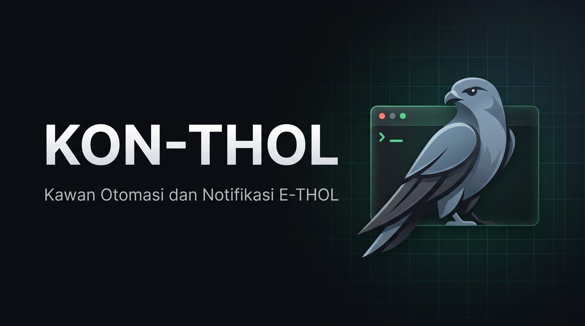

<p align="center">
  
</p>

# KON-THOL 👀🐦
### "Kawan Otomasi dan Notifikasi untuk E-THOL PENS"

**KON-THOL** adalah bot asisten automasi pribadi untuk kebutuhan perkuliahan yang cerdas berbasis Python & Telegram Bot untuk mahasiswa Politeknik TERBAEKKK se-Asia Tenggara. Dirancang untuk mempermudah mahasiswa memantau presensi, mengecek jadwal kuliah, serta mencatat tugas yang belum dikumpulkan dengan antarmuka yang sangat mudah digunakan.

---

## Pilihan Penggunaan: Di-pair ke Bot Telegram atau Dijalankan dari Terminal / HP

Bot **KON-THOL** dirancang paling optimal ketika **di-pair / diintegrasikan dengan Bot Telegram pribadi** Anda:
- Anda memiliki kendali langsung di genggaman smartphone tanpa perlu selalu membuka laptop atau terminal.
- Notifikasi presensi berhasil, tugas baru, dan pengingat deadline langsung masuk ke chat Telegram Anda.
- Seluruh perintah dapat diakses cepat menggunakan *slash command* standar.

> [!TIP]
> Menghubungkan bot ke Telegram pribadi adalah cara paling nyaman: seluruh informasi jadwal, rekap kehadiran, dan tugas kuliah bisa diakses cukup dengan satu ketukan tombol di HP Anda tanpa repot menyalakan laptop atau terminal.

**Apakah bisa dipakai tanpa Telegram (Hanya dari Terminal)?**  
Bisa. Anda tetap dapat menjalankan script di laptop atau HP (Termux) secara mandiri:
1. **Notifikasi Tetap Masuk Langsung ke Perangkat:**
   - **Di HP Android (Termux):** Notifikasi presensi dan tugas akan muncul sebagai banner notifikasi di status bar HP Anda (menggunakan paket `termux-api`).
   - **Di Konsol Terminal (Windows / Linux):** Seluruh konfirmasi presensi dan notifikasi dicetak rapi dan jelas secara real-time di layar terminal.
2. **Mode Interaktif Terminal (Ketik Perintah Langsung):**
   Saat script berjalan di terminal atau Termux, Anda bisa langsung mengetik perintah interaktif seperti `scan`, `jadwal`, `tugas`, `rekap`, `log`, `status`, `cooldown`, atau `resume` untuk mendapatkan respon langsung di layar terminal Anda!

> [!IMPORTANT]
> **Catatan Stabilitas:** Selain penggunaan melalui bot Telegram, **BELUM DAPAT DIPASTIKAN BAHWA YANG DIPAKAI AKAN STABLE**. Hal ini karena manajemen baterai background pada smartphone (Termux) maupun mode sleep pada laptop dapat mematikan proses sewaktu-waktu di luar kendali kita. Mode operasional yang **pasti stable dan teruji** adalah ketika di-pair dengan Bot Telegram pribadi Anda (terlebih jika dijalankan di VPS/server Linux 24/7).

---

## Fitur Utama

- **Otomasi Presensi Tenang & Cepat**:  
  Memantau dan mengisi presensi secara otomatis ketika sesi kuliah dibuka oleh dosen, sehingga Anda tidak perlu cemas terlewat sesi presensi saat sedang fokus menyimak materi.
- **Antarmuka Rapi & Otomatis (Single-View Clean UI)**:  
  Chat Telegram tetap bersih dan rapi layaknya dashboard aplikasi! Perintah yang telah usang beserta pesan interaksi perantara otomatis dibersihkan dari ruang chat, menyisakan Banner Menu utama di atas dan hasil perintah terbaru Anda di bawahnya.
- **Jadwal Operasional Cerdas (Siaga Subuh & Istirahat Malam)**:  
  - 🌅 **Siaga Subuh (Mulai 04:00 WIB)**: Aktif sejak waktu sebelum azan Subuh berkumandang untuk siaga memantau persiapan sesi dan jadwal perkuliahan hari ini.  
  - 🟢 **Siaga Penuh (06:30 - 21:30 WIB)**: Memantau presensi dan jadwal secara aktif di jam perkuliahan reguler.  
  - 💤 **Istirahat Malam (21:30 - 04:00 WIB)**: Mengistirahatkan frekuensi polling saat larut malam karena tidak ada perkuliahan aktif di tengah malam, menghemat beban server secara etis dan efisien.
- **Jadwal Kuliah Rapi & Info Dosen**:  
  Menampilkan jadwal mingguan rapi terurut hari & jam lengkap dengan waktu, ruang kuliah, nama dosen pengampu, serta indikator kehadiran untuk mata kuliah hari ini.
- **Pemantau Tugas & Tautan Portal ETHOL**:  
  Menyajikan daftar tugas kuliah yang belum dikumpulkan secara rapi, lengkap dengan sisa waktu tenggat dan tautan langsung untuk membuka halaman pengumpulan tugas di ETHOL.
- **Statistik & Rekapitulasi Kehadiran Resmi**:  
  Melihat persentase kehadiran semester berjalan serta rincian sesi kehadiran per mata kuliah secara transparan dan akurat.
- **Pengecekan Notifikasi Terkini**:  
  Memeriksa notifikasi tugas baru dan presensi perkuliahan langsung dari portal ETHOL secara real-time.
- **Transparansi Log Aktivitas Sistem**:  
  Menyajikan 15 baris catatan log aktivitas sistem terbaru (via `/log` atau CLI `log`) untuk memudahkan pemantauan proses presensi dan deteksi sesi tanpa perlu membuka file log manual.
- **Mode Cooldown (Istirahat Harian)**:  
  Dapat mengistirahatkan scanner presensi setelah kuliah hari ini selesai menggunakan perintah `/cooldown` dan mengembalikannya ke siaga penuh dengan `/resume`.

*(Catatan: Varian publik V1 ini beroperasi menggunakan antarmuka teks/slash command ringan yang hemat sumber daya. Antarmuka interaktif inline-keyboard klik-klik 2 halaman dengan update banner di tempat dan adaptive burst scheduler merupakan fitur arsitektur lanjutan pada varian Private V2).*

---

## Pilihan Metode Instalasi

Pilih metode yang paling sesuai dengan kebutuhan dan kenyamanan Anda:

```
┌─────────────────────────┬────────────────────────────────────────────────────────┐
│ Metode                  │ Kelebihan & Karakteristik                              │
├─────────────────────────┼────────────────────────────────────────────────────────┤
│ 📱 Android (Termux)     │ 100% Gratis, IP seluler/Wi-Fi natural, HP selalu dibawa│
│ ☁️ VPS / Cloud Linux    │ Paling stabil jalan 24/7 di background tanpa baterai   │
│ 💻 Laptop / PC Pribadi  │ Sangat mudah dijalankan saat jam perkuliahan           │
└─────────────────────────┴────────────────────────────────────────────────────────┘
```

---

### Metode 1: Instalasi di HP Android (Termux) — Rekomendasi Hemat

Cocok untuk Anda yang ingin solusi gratis tanpa perlu menyewa server, karena smartphone selalu dibawa ke kampus.

1. **Instal Termux:**  
   Unduh dan pasang aplikasi **Termux** (disarankan dari [F-Droid](https://f-droid.org/en/packages/com.termux/) atau GitHub Release Termux).
2. **Siapkan Lingkungan & Cegah Mode Tidur:**  
   Buka Termux, lalu jalankan perintah berikut:
   ```bash
   pkg update && pkg install python git termux-api -y
   termux-wake-lock
   ```

   *(Penting: Setel pengaturan baterai aplikasi Termux di pengaturan HP Anda ke **"Tidak Dibatasi / Unrestricted"** agar proses tidak dimatikan sistem saat layar mati).*
3. **Unduh Repositori & Pasang Dependensi:**
   ```bash
   git clone https://github.com/Gungna/KON-THOL.git
   cd KON-THOL
   pip install requests beautifulsoup4 urllib3
   ```
4. **Jalankan Wizard Konfigurasi:**
   ```bash
   python setup.py
   ```
5. **Jalankan Bot:**
   ```bash
   python ethol_autopresence.py
   ```

---

### Metode 2: Instalasi di VPS / Cloud Linux (Debian / Ubuntu) — Rekomendasi 24/7

Cocok untuk Anda yang menginginkan bot siaga nonstop 24 jam sehari di background tanpa bergantung pada perangkat pribadi.

1. **Pasang Paket Kebutuhan:**
   ```bash
   sudo apt update && sudo apt install python3 python3-pip git -y
   ```
2. **Unduh Repositori & Library:**
   ```bash
   git clone https://github.com/Gungna/KON-THOL.git /opt/ethol-autopresence
   cd /opt/ethol-autopresence
   pip3 install requests beautifulsoup4 urllib3
   ```
3. **Jalankan Setup Wizard Kredensial:**
   ```bash
   python3 setup.py
   ```
4. **Jalankan Bot:**
   ```bash
   python3 ethol_autopresence.py
   ```

---

### Metode 3: Instalasi di Laptop / PC Pribadi (Windows / Mac)

1. Pastikan Anda telah memasang **Python 3.10+**.
2. Buka Terminal / PowerShell di folder proyek, lalu pasang dependensi:
   ```bash
   pip install requests beautifulsoup4 urllib3
   ```
3. Jalankan wizard konfigurasi:
   ```bash
   python setup.py
   ```
4. Jalankan bot:
   ```bash
   python ethol_autopresence.py
   ```

---

## Struktur Berkas

```
KON-THOL/
├── ethol_autopresence.py      # Script utama asisten & auto presensi
├── setup.py                   # Wizard interaktif setup kredensial akun & bot
├── credentials.json           # Konfigurasi kredensial tersimpan lokal (jangan di-commit)
├── config.example.json        # Template manual konfigurasi kredensial
├── attended_keys.json         # Riwayat sesi presensi tercatat (auto-generated)
├── autopresence.log           # Log aktivitas sistem
├── assets/                    # Aset banner dan gambar bot
└── README.md                  # Panduan penggunaan
```

---

## Daftar Perintah

Perintah dapat diakses baik melalui pesan chat Telegram (*slash command*) maupun langsung diketik di Terminal / CLI saat script berjalan:

| Slash Command | Terminal CLI | Fungsi Utama |
| :--- | :--- | :--- |
| `/scan` atau `/absen` | `scan` | Memindai seluruh mata kuliah dan mengisi presensi yang sedang terbuka |
| `/jadwal` atau `/matkul` | `jadwal` | Menampilkan jadwal mingguan rapi + info dosen & status hadir hari ini |
| `/tugas` | `tugas` | Menampilkan tugas belum dikumpulkan beserta link pengumpulan portal ETHOL |
| `/rekap` | `rekap` | Statistik rekapitulasi kehadiran semester dan kehadiran per mata kuliah |
| `/log` | `log` | Menampilkan 15 baris catatan riwayat log aktivitas sistem terbaru |
| `/status` | `status` | Ringkasan identitas mahasiswa, status sesi login SSO, dan status scanner |
| `/cooldown` | `cooldown` | Mengistirahatkan scanner presensi setelah kuliah hari ini selesai |
| `/resume` | `resume` | Membatalkan cooldown dan mengembalikan scanner ke mode siaga penuh |
| `/relogin` | `relogin` | Sinkronisasi ulang sesi autentikasi SSO PENS jika token kedaluwarsa |
| `/help` | `help` | Menampilkan ringkasan fungsi dan panduan perintah bot |

---

## Disclaimer & Orisinalitas Proyek

Seluruh baris kode, integrasi notifikasi, dan logika otomatisasi dalam proyek **KON-THOL** ini dirancang serta ditulis secara mandiri dari nol (*from scratch*) oleh pembuat melalui eksplorasi dan riset independen terhadap API portal E-THOL PENS. Proyek ini murni dibuat atas inisiatif pribadi tanpa pernah melihat, menyalin, ataupun mencontoh script dari pihak lain.

Oleh karena itu, apabila di kemudian hari terdapat script, bot, atau software pembantu presensi ETHOL lain yang beredar di kalangan mahasiswa dan memiliki kesamaan struktur logika atau kode, besar kemungkinan software tersebut berasal dari atau mengadopsi basis kode repositori ini.

> [!NOTE]
> **Catatan Penamaan Proyek:**  
> Penamaan akronim **KON-THOL** (*Kawan Otomasi dan Notifikasi untuk E-THOL*) dibuat semata-mata sebagai humor dan candaan ringan antar sesama mahasiswa. Kami menaruh rasa hormat yang setinggi-tingginya serta apresiasi yang tulus kepada segenap jajaran Sivitas Akademika PENS dan tim pengembang portal **E-THOL PENS** yang telah menghadirkan sistem perkuliahan digital yang luar biasa andal dan bermanfaat bagi kita semua.

Perangkat lunak ini dikembangkan secara independen sebagai asisten akademik pribadi nirlaba untuk mempermudah produktivitas belajar mahasiswa. Pengguna diharapkan tetap mematuhi seluruh peraturan, etika, dan tata tertib akademik yang berlaku di kampus. Harap menjaga kerahasiaan data akun Anda dan **JANGAN PERNAH** membagikan berkas `credentials.json` ke repositori publik.
